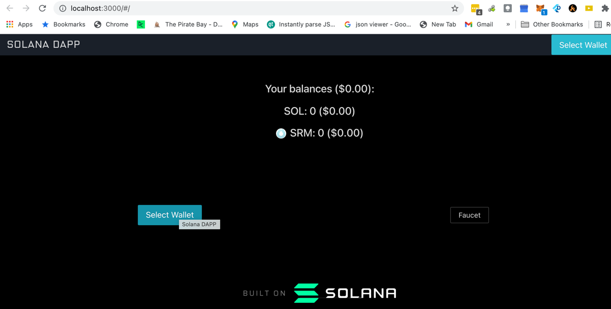
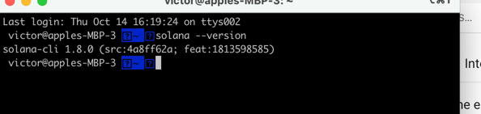
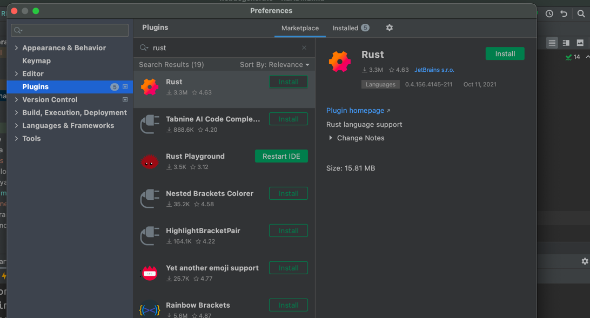

## Run this thing

```
yarn sol:runValidator
yarn sol:ValidatorConfig
```

Check

```
yarn sol:ValidatorHash
## should match the runValidator
Genesis Hash: 7og1v7GopxiW4izxKpeHXWXUGvN47ZFetBp3W8w5LKoi

```

Check balance

```
yarn sol:CheckBalance
```

No wallet

````
yarn sol:genWallet

````

Public key location /Users/victor/.config/solana/id.json

Note: BIP39 - NONE Something like this as public key

```
 8R84KzaZK27KUZMhaio4kxgr7r2cLsGkowM3af8kXg4Q
```

Seed for this account

```
problem together crazy fossil toss loud mother divide salmon tonight vapor enroll
```

Get banans

```
yarn sol:getbanans
```

Get Balance

```
yarn sol:checkaccount

```

Gen Random Wallet Aj94M5te4ijry2y58YT9QrrQfGP2PxBGeHG9ps5bUqZz enhance liar sausage guess decide online bracket mix
scale immense trigger crush

```
yarn sol:genWalletTemp
```

## Inspiration

Amazon sell shit load of goods, Reddit have shit load of users, We should have shit load of NTFs

NFTs is awesome, it will be massive adapted with the Solana

YoLo NFTs-> NTFs of everything .

What if we can make NFT directly on my phone?

ID card, bank statement, Coupons, Membership cards, Credit cards, tax payment, bills everything is NFTs. Cat Name, Dog
Name, bunch of random things into different wallet address

Would that ever work?

and what is that really look like

let's find out

Power to the Player!!!

## What it does

Amazon like-E-commerical Store in Reddit Style features only NFTs , Free Delivery and NO MORE Warranty card sign up and
dont ever try to steal my membership points again

- Mobile First
- Check out for buying lot of NFTs finally,
- Pay Bills
- P to P transfer
- Buy NFTs pork chop first and get the grocery deliver to my house(awesome)
- Waitress give me a NFTs instead of bill(jacked to tits)

## How we built it

Flutter for both IOS and Android, Multi API with Solana,

- local chain for now ,Rest of them need to figure it out.
- candy machine as service

## Challenges we ran into

- No direct binding with any wallets due to the ios and apk design the best way is to use API as Service, upgrade at
  ease

## Accomplishments that we're proud of

It is lot of fun to make this thing

## What we learned

Everything is new to me

## What's next for Degenerate

Keep adding features , day by day,and have some fun

## Built With

flutter, hasura, solana , firebase for auth, firebase

----
To-do -- need to setup the enviroment -- Build a hello world with Rust and intellij

## Note

Solana is not EVM compatible but it offers a bidirectional token bridge between Solana and Ethereum so projects can move
tokenized assets across blockchains.

Role of the SOL token : The token is used to pay for the transaction fees in the network and to reward participant in
the Proof of Stake consensus


----

## Referenece

https://explorer.solana.com/?cluster=custom&customUrl=http%3A%2F%2F127.0.0.1%3A8899


----
Logs

October 14, 2021 6:31 PM Solo is kind of tough one, so we have a thing call program , needed the

```
Cargo.toml 
```

to work October 14, 2021 4:58 PM 30 mins, Solana is up and running



October 14, 2021 4:28 PM Looks like the Solana CLI need lot of shit command let's yarn it

October 14, 2021 4:20 PM



October 14, 2021 4:11 PM Project init




