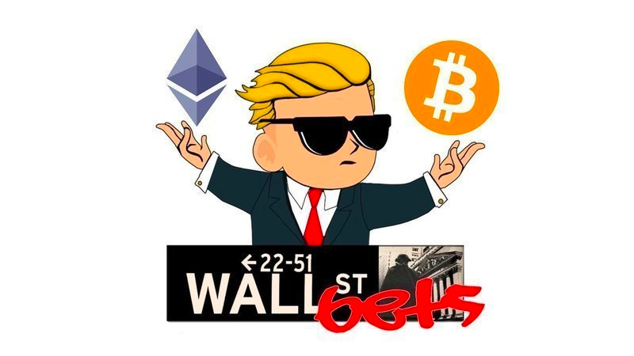

##Inspiration
Started with a guy in youtube saying beloved GameStop is going out of businss.

Support by buying then YOLO life saving at different stage while packing with crowdsourced idea and confirmation(DD).

Cover the strong basic BUY AND STRONG HOLD

The diamoon hand strategy

##What it does
Reddit Style -Social Ideas for invest as retails, uniform information for how hedgies, the market maker take advantage of us.

One click Yolo(Clean the floor ) for the NFTs,

Direct named NFT

##How we built it
Flutter for both IOS and Android, Multi-chain with Solana, Main net Rest of them need to figure it out.

##Challenges we ran into
Learning Rust, and dont have docker Setting the enviroment is kind of tedious

##Accomplishments that we're proud of
For once we finally own something

##What we learned
Rust is pretty good language and solana is fast

##What's next for Degenerate
Keep adding features , day by day, have some fun

##Built With
flutter, hasura, solana

----
To-do
-- need to setup the enviroment
-- Build a hello world  with Rust and intellij

----    
Logs

October 14, 2021 4:20 PM

October 14, 2021 4:11 PM
Project init

